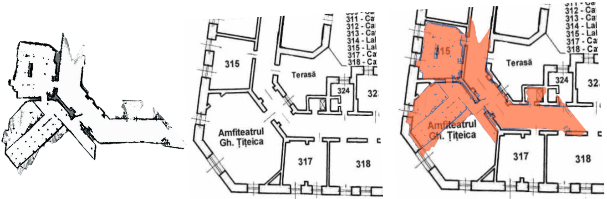

# Ackermann Autonomous Vehicle (ROS 2)

This project is a ROS 2-based Ackermann-steered autonomous ground vehicle capable of performing real-time SLAM and autonomous navigation in dynamic environments. It integrates ROS 2 Control for hardware interface, SLAM Toolbox for mapping and localization, and Nav2 for path planning and obstacle avoidance.


---

## Features

- Ackermann steering kinematics
- Real-time SLAM using [SLAM Toolbox](https://github.com/SteveMacenski/slam_toolbox)
- Autonomous navigation using [Nav2](https://github.com/ros-planning/navigation2)
- Dynamic obstacle avoidance
- ROS 2 Control integration for motor and servo interfaces
- Supports RViz2 visualization
- URDF-based robot model with accurate transforms

---

## Stack Overview

| Component     | Package / Framework               |
| ------------- | --------------------------------- |
| OS            | Ubuntu 22.04                      |
| ROS 2 Version | Humble                            |
| SLAM          | SLAM Toolbox                      |
| Navigation    | Nav2                              |
| Control       | ros2_control + hardware_interface |
| Visualization | RViz2                             |

---

## System Architecture

```text
[Sensors: LIDAR, IMU, Encoders]
        |
        v
[ROS 2 Hardware Interface (ros2_control)]
        |
        v
[Base Controller (ackermann_steering_controller)]
        |
        v
[tf2 + odom -> base_link]
        |
        v
[SLAM Toolbox] <--> [Map Server]
        |
        v
[Nav2 Stack] <---> [Costmaps + Planners + Controllers]
```

# Other pictures

### Robot side


---

### SLAM precision



---
